# Dự án Website Mikasa Juku

Chào mừng bạn đến với mã nguồn của hệ thống website **三笠塾 (Mikasa Juku)**. Dự án được triển khai trên môi trường Local thông qua Laragon và bao gồm nhiều phân hệ khác nhau.

---

## 1. Cấu trúc dự án (Project Structure)

Dự án này là sự kết hợp của mã nguồn Custom PHP (ở thư mục gốc) và hai trang WordPress độc lập đặt trong các thư mục con:

* **Trang chủ chính (Custom PHP)**: Nằm trực tiếp ở thư mục gốc `/`. Giao diện chính là file [`index.php`](file:///c:/laragon/www/mikasajyuku/index.php).
* **Trang giới thiệu (WordPress 1)**: Nằm trong thư mục [`/mikasa_hp/`](file:///c:/laragon/www/mikasajyuku/mikasa_hp/).
* **Trang Blog tin tức (WordPress 2)**: Nằm trong thư mục [`/blog/`](file:///c:/laragon/www/mikasajyuku/blog/).
* **Trang Home cũ (WordPress 3)**: Nằm trong thư mục [`/home/`](file:///c:/laragon/www/mikasajyuku/home/).

---

## Sơ đồ cấu trúc hệ thống (Mermaid Diagram)

```mermaid
graph TD
    %% Định nghĩa các lớp User / Client
    User((Người dùng truy cập))

    %% Phân nhánh URL chính
    User -->|/| RootSite[Trang chủ chính: mikasajyuku.jp<br>Thư mục gốc /]
    User -->|/mikasa_hp/| MikasaHP[Trang giới thiệu: mikasajyuku.jp/mikasa_hp/<br>Thư mục /mikasa_hp/]
    User -->|/blog/| BlogSite[Trang Blog: mikasajyuku.jp/blog/<br>Thư mục /blog/]
    User -->|/home/| HomeSite[Trang Home cũ: mikasajyuku.jp/home/<br>Thư mục /home/]

    %% Chi tiết Phân hệ gốc (Root)
    subgraph RootFolder [Thư mục Gốc / - Custom PHP]
        direction TB
        IndexPHP["index.php<br>(Giao diện trang chủ)"]
        DbConn["controller/db_connection.php<br>(Cấu hình kết nối DB)"]
        Styles["styles/ (CSS)<br>js/ (Javascript)"]
        IndexPHP --> DbConn
        IndexPHP -.-> Styles
    end

    %% Chi tiết Phân hệ giới thiệu (mikasa_hp)
    subgraph MikasaHpFolder [Thư mục /mikasa_hp/ - WordPress 1]
        direction TB
        WpConfig1["wp-config.php<br>(Cấu hình DB)"]
        WpContent1["wp-content/<br>(Themes & Plugins)"]
    end

    %% Chi tiết Phân hệ Blog (blog)
    subgraph BlogFolder [Thư mục /blog/ - WordPress 2]
        direction TB
        WpConfig2["wp-config.php<br>(Cấu hình DB)"]
        WpContent2["wp-content/<br>(Themes & Plugins)"]
    end

    %% Chi tiết Phân hệ Home cũ (home)
    subgraph HomeFolder [Thư mục /home/ - WordPress 3]
        direction TB
        WpConfig3["wp-config.php<br>(Cấu hình DB)"]
        WpContent3["wp-content/<br>(Themes & Plugins)"]
    end

    %% Các Database
    subgraph Databases [Hệ thống Cơ sở dữ liệu]
        DB_MikasaHP[(Database: kogaku-sha_mikasa_hp)]
        DB_Blog[(Database: kogaku-sha_mksdb)]
        DB_Home[(Database: kogaku-sha_home)]
    end

    %% Mối quan hệ Database
    DbConn -->|Kết nối đọc bảng tin mikasahp_wpposts| DB_MikasaHP
    WpConfig1 -->|Kết nối lưu trữ nội dung| DB_MikasaHP
    WpConfig2 -->|Kết nối lưu trữ bài viết blog| DB_Blog
    WpConfig3 -->|Kết nối lưu trữ nội dung home cũ| DB_Home

    %% Định dạng phong cách
    style RootSite fill:#f9f,stroke:#333,stroke-width:2px
    style MikasaHP fill:#bbf,stroke:#333,stroke-width:2px
    style BlogSite fill:#bfb,stroke:#333,stroke-width:2px
    style HomeSite fill:#fbf,stroke:#333,stroke-width:2px
    style DB_MikasaHP fill:#fdd,stroke:#333,stroke-width:2px
    style DB_Blog fill:#ffd,stroke:#333,stroke-width:2px
    style DB_Home fill:#dff,stroke:#333,stroke-width:2px
```



---

## 2. Cấu trúc File & Database kết nối

Mỗi phân hệ có một file cấu hình kết nối Database riêng. Dưới đây là thông tin chi tiết:

| Phân hệ | Đường dẫn file cấu hình | Tên Database mặc định (Online) | Ghi chú |
| :--- | :--- | :--- | :--- |
| **Trang chủ gốc** | [`controller/db_connection.php`](file:///c:/laragon/www/mikasajyuku/controller/db_connection.php) | `kogaku-sha_mikasa_hp` | Dùng PHP thuần đọc bảng tin |
| **Trang giới thiệu** | [`mikasa_hp/wp-config.php`](file:///c:/laragon/www/mikasajyuku/mikasa_hp/wp-config.php) | `kogaku-sha_mikasa_hp` | Sử dụng prefix bảng `mikasahp_wp` |
| **Trang Blog** | [`blog/wp-config.php`](file:///c:/laragon/www/mikasajyuku/blog/wp-config.php) | `kogaku-sha_mksdb` | Sử dụng prefix bảng `mks_` |
| **Trang Home cũ** | [`home/wp-config.php`](file:///c:/laragon/www/mikasajyuku/home/wp-config.php) | `kogaku-sha_home` | Sử dụng prefix bảng `mks_home` |

> [!IMPORTANT]
> Phần **Bảng tin (掲示板)** trên trang chủ gốc đọc dữ liệu từ bảng `mikasahp_wpposts` thuộc cơ sở dữ liệu `kogaku-sha_mikasa_hp`. Do đó, khi bạn đăng bài viết mới trên trang giới thiệu `/mikasa_hp/`, bài viết sẽ tự động xuất hiện ở phần bảng tin trang chủ.

---

## 3. Hướng dẫn chạy môi trường Local (Laragon)

Để cài đặt và chạy thử nghiệm dự án này trên máy tính cá nhân của bạn, hãy làm theo các bước dưới đây:

### Bước 1: Chuẩn bị Database Local
1. Mở Laragon, khởi động **MySQL** và **Apache**.
2. Truy cập vào phpMyAdmin (hoặc Database tool của bạn như HeidiSQL).
3. Tạo mới 3 Database trống tương ứng trên local:
   * `kogaku-sha_mikasa_hp`
   * `kogaku-sha_mksdb`
   * `kogaku-sha_home`
4. Import dữ liệu từ bản backup SQL của bạn vào 3 Database này.

### Bước 2: Cập nhật thông số kết nối Local
Thay đổi thông số kết nối Database từ Online sang Local trong các file cấu hình.

Mặc định trên Laragon:
* **Host**: `127.0.0.1` (hoặc `localhost`)
* **Username**: `root`
* **Password**: `""` (để trống)

#### A. Cập nhật trang chủ gốc ([`controller/db_connection.php`](file:///c:/laragon/www/mikasajyuku/controller/db_connection.php)):
```php
$dbhost = "127.0.0.1";
$dbuser = "root";
$dbpass = "";
$db = "kogaku-sha_mikasa_hp";
```

#### B. Cập nhật trang giới thiệu ([`mikasa_hp/wp-config.php`](file:///c:/laragon/www/mikasajyuku/mikasa_hp/wp-config.php)):
```php
define('DB_HOST', '127.0.0.1');
define('DB_USER', 'root');
define('DB_PASSWORD', '');
define('DB_NAME', 'kogaku-sha_mikasa_hp');
```

#### C. Cập nhật trang Blog ([`blog/wp-config.php`](file:///c:/laragon/www/mikasajyuku/blog/wp-config.php)):
```php
define('DB_HOST', '127.0.0.1');
define('DB_USER', 'root');
define('DB_PASSWORD', '');
define('DB_NAME', 'kogaku-sha_mksdb');
```

#### D. Cập nhật trang Home cũ ([`home/wp-config.php`](file:///c:/laragon/www/mikasajyuku/home/wp-config.php)):
```php
define('DB_HOST', '127.0.0.1');
define('DB_USER', 'root');
define('DB_PASSWORD', '');
define('DB_NAME', 'kogaku-sha_home');
```

---

## 4. Hướng dẫn phát triển & Customize trang chủ

* **Giao diện trang chủ**: Sửa đổi trực tiếp tại [`index.php`](file:///c:/laragon/www/mikasajyuku/index.php).
* **Styles (CSS)**: Được lưu trong thư mục [`styles/`](file:///c:/laragon/www/mikasajyuku/styles/) (chủ yếu là `home.css`, `navbar.css`, `page_top.css`).
* **Scripts (JS)**: Được lưu trong thư mục [`js/`](file:///c:/laragon/www/mikasajyuku/js/).
* **Hình ảnh & Banner**: Đặt trong thư mục [`images/`](file:///c:/laragon/www/mikasajyuku/images/).
